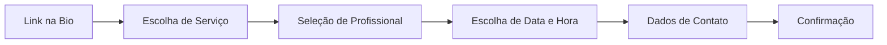

# 05 - Visão de Produto e UX (Fricção Zero)

Este documento estabelece as diretrizes de experiência do usuário (UX), a visão de produto e o impacto técnico das decisões de usabilidade do **VamoAgendar**.

---

## ⚡ Regra da Fricção Zero (B2C)

A principal barreira de conversão em agendamentos online é a exigência de cadastro, download de aplicativos ou login por parte do cliente final. No **VamoAgendar**, a regra de ouro é: **O cliente final nunca faz login ou valida tokens para agendar um horário.**

* **Sem Cadastro:** Não existe fluxo de "criar conta" ou "esqueci minha senha" para o cliente que está agendando.
* **Sem Validação Exigida:** Não forçamos o cliente a validar e-mail ou SMS via OTP (One-Time Password) no momento do agendamento, agilizando o processo para que ocorra em segundos.
* **Conversão em Primeiro Lugar:** O fluxo simula a simplicidade de uma conversa de WhatsApp, mas estruturada.

---

## 📱 Fluxo de Telas do Cliente Final (B2C)

O fluxo na página pública de agendamento (`/book/[slug]` ou similar) deve ser linear e resolvido em poucas etapas:



1. **Link de Acesso:** O cliente acessa `vamoagendar.com.br/[slug_da_empresa]`.
2. **Seleção do Serviço:** O cliente visualiza a lista de serviços com preços e durações e escolhe o que deseja.
3. **Seleção de Profissional:** Se a empresa tiver múltiplos profissionais, o cliente escolhe com quem quer ser atendido ou seleciona "Qualquer um".
4. **Seleção de Data e Horário:** O cliente vê os dias e horários livres calculados em tempo real.
5. **Preenchimento de Contato:** O cliente preenche apenas:
   * Nome Completo
   * WhatsApp (opcional para lembretes)
   * E-mail (opcional para lembretes)
   ** Ou é email ou whatspp, algum dos dois tem que ser
6. **Confirmação:** O cliente clica em "Confirmar Agendamento" e visualiza a tela de sucesso com os detalhes do agendamento. Um lembrete é agendado no Upstash QStash para envio de mensagem via WhatsApp.

---

## 🏢 Fluxo do Dashboard do Profissional (B2B)

Diferente do cliente final, o profissional (empresa/tenant) autentica-se de forma segura via **Clerk** (usando Organizations). O painel administrativo preza por simplicidade operacional:

1. **Dashboard Principal:** Visualização consolidada dos próximos agendamentos do dia/semana e controle de status (Confirmado, Cancelado, Realizado).
2. **Configuração de Agenda:** Definição dos dias de funcionamento da empresa e janelas horárias padrão (ex: Segunda a Sexta, das 08:00 às 18:00).
3. **Gerenciamento de Serviços:** Cadastro de serviços com nome, duração (em minutos) e preço.
4. **Exceções & Bloqueios:** Adição rápida de feriados, folgas temporárias ou bloqueio manual de horários específicos em que o profissional não estará disponível.

---

## 💳 Regra de Negócio sobre Pagamentos

* **Cobrança do SaaS (Nós para o Profissional):** Nós monetizamos cobrando uma assinatura mensal ou anual do profissional/empresa para uso da plataforma (gerenciado via Asaas).
* **Pagamento do Serviço (Profissional para o Cliente Final):** O VamoAgendar **NÃO** processa o pagamento do serviço prestado (corte de cabelo, consulta, aula, etc.). O acerto financeiro do serviço ocorre diretamente entre o cliente final e o profissional no momento do atendimento físico ou por meios combinados entre eles.

---

## 🔐 Impacto Técnico e Segurança no Banco (Supabase RLS)

Como o cliente final realiza ações sem estar autenticado, precisamos de um desenho de segurança robusto que impeça abusos sem travar a experiência do usuário.

### 1. Políticas de RLS Públicas (`INSERT`)
A inserção de registros na tabela de `agendamentos` e `clientes` (ou `clientes_leads`) deve permitir escrita pública pela role `anon`, mas com restrições severas:

```sql
-- Exemplo conceitual para permitir criação pública de agendamento por anônimos
CREATE POLICY "Permitir inserções públicas (anônimas)"
ON agendamentos FOR INSERT TO anon
WITH CHECK (
    -- Garante que o tenant_id seja preenchido e pertença a uma organização existente/ativa
    tenant_id IS NOT NULL 
    AND EXISTS (
        SELECT 1 FROM tenants_config 
        WHERE tenants_config.tenant_id = agendamentos.tenant_id 
          AND tenants_config.status = 'ativo'
    )
);
```

### 2. Validação Severa no Backend (Next.js Server Actions)
Como o endpoint de criação é público, a Server Action que processa o agendamento deve agir como o "porteiro" do banco de dados, aplicando validações rigorosas antes de chamar o Supabase:

* **Validação de Slot Disponível:** A action deve recalcular e validar se aquele horário ainda está de fato disponível, evitando *double-booking* e inserções fraudulentas de horários do passado ou já reservados.
* **Sanitização de Entradas:** Limpar caracteres especiais e validar formatação do WhatsApp (usando regex ou biblioteca de validação como Zod).
* **Prevenção de Abuso (Rate Limiting/Anti-Spam):** No futuro, limitar a quantidade de agendamentos por número de WhatsApp ou IP em curtos períodos de tempo para evitar scripts maliciosos derrubando a agenda dos profissionais.
