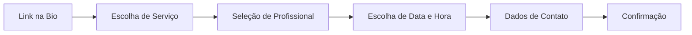

# 05 - Visão de Produto e UX (Fricção Zero)

Este documento estabelece as diretrizes de experiência do usuário (UX), a visão de produto e o impacto técnico das decisões de usabilidade do **VamoAgendar**.

---

## ⚡ Regra da Fricção Zero (B2C)

A principal barreira de conversão em agendamentos online é a exigência de cadastro, download de aplicativos ou login por parte do cliente final. No **VamoAgendar**, a regra de ouro é: **O cliente final nunca faz login ou valida tokens para agendar um horário.**

* **Sem Cadastro:** Não existe fluxo de "criar conta" ou "esqueci minha senha" para o cliente que está agendando.
* **Sem Validação Exigida:** Não forçamos o cliente a validar e-mail ou SMS via OTP (One-Time Password) no momento do agendamento, agilizando o processo para que ocorra em segundos.
* **Conversão em Primeiro Lugar:** O fluxo simula a simplicidade de uma conversa de WhatsApp, mas estruturada.

---

## 📱 Fluxo de Telas do Cliente Final (B2C)

O fluxo na página pública de agendamento (`/book/[slug]` ou similar) deve ser linear e resolvido em poucas etapas:

1. **Link de Acesso:** O cliente acessa `vamoagendar.com.br/[slug_da_empresa]`.
2. **Seleção do Serviço:** O cliente visualiza a lista de serviços com preços e durações e escolhe o que deseja.
3. **Seleção de Profissional** *(pós-MVP — ainda não implementado)*: quando a empresa tiver múltiplos profissionais, o cliente escolherá com quem quer ser atendido ou "Qualquer um". **Não** serão contas/membros separados: a própria conta do tenant cadastra seus profissionais, cada um com horários e/ou serviços próprios (ver `docs/PENDENCIAS.md`).
4. **Seleção de Data e Horário:** O cliente vê os dias e horários livres calculados em tempo real.
5. **Preenchimento de Contato:** O cliente preenche apenas:
   * Nome
   * WhatsApp (obrigatório — é por ele que o estabelecimento confirma o horário)

   > Regra vigente desde 2026-07-17: **WhatsApp obrigatório**; o campo de e-mail saiu
   > da UI pública enquanto não existir envio por e-mail (a promessa era falsa).
   > Regra-alvo registrada no P1.8 do `docs/PENDENCIAS.md`: quando o envio por e-mail
   > existir, volta a valer "pelo menos um dos dois" (e-mail OU WhatsApp).
6. **Confirmação:** O cliente confirma no CTA da barra inferior e visualiza a tela de sucesso com os detalhes do agendamento (incluindo endereço com link de mapa e Instagram do estabelecimento, quando cadastrados). Um lembrete é agendado no Upstash QStash para envio de mensagem via WhatsApp.

**Layout (desde 2026-07-17, P0.12c):** o fluxo é de **etapas em tela cheia**
mobile-first (sensação de app, não card flutuante): cabeçalho com a identidade do
estabelecimento (capa/logo/cor para tenants Pro; bio, Instagram e endereço para
todos) que colapsa numa barra compacta com progresso, e **barra-resumo fixa** no
rodapé que se preenche com as escolhas (serviço · preço · duração · data · hora) com
o CTA sempre visível. Base visual = identidade oficial do VamoAgendar; o acento do
tenant Pro entra por cima com contraste garantido.

---

## 🏢 Fluxo do Dashboard do Profissional (B2B)

Diferente do cliente final, o profissional (empresa/tenant) autentica-se de forma segura via **Clerk** (usando Organizations). O painel administrativo preza por simplicidade operacional:

1. **Dashboard Principal:** Visualização consolidada dos próximos agendamentos do dia/semana e controle de status (Confirmado, Cancelado, Realizado).
2. **Configuração de Agenda:** Definição dos dias de funcionamento da empresa e janelas horárias padrão (ex: Segunda a Sexta, das 08:00 às 18:00).
3. **Gerenciamento de Serviços:** Cadastro de serviços com nome, duração (em minutos) e preço.
4. **Exceções & Bloqueios:** Adição rápida de feriados, folgas temporárias ou bloqueio manual de horários específicos em que o profissional não estará disponível.

---

## 💳 Regra de Negócio sobre Pagamentos

* **Cobrança do SaaS (Nós para o Profissional):** Nós monetizamos cobrando uma assinatura mensal ou anual do profissional/empresa para uso da plataforma (gerenciado via Asaas).
* **Pagamento do Serviço (Profissional para o Cliente Final):** O VamoAgendar **NÃO** processa o pagamento do serviço prestado (corte de cabelo, consulta, aula, etc.). O acerto financeiro do serviço ocorre diretamente entre o cliente final e o profissional no momento do atendimento físico ou por meios combinados entre eles.

---

## 🔐 Impacto Técnico e Segurança no Banco (Supabase RLS)

Como o cliente final realiza ações sem estar autenticado, precisamos de um desenho de segurança robusto que impeça abusos sem travar a experiência do usuário.

### 1. Escritas do fluxo público via servidor privilegiado (decisão registrada no P0.2)
O visitante anônimo **não** escreve diretamente no banco. A Server Action `criarAgendamentoPublico` é o único caminho de escrita do fluxo público: após validar **tudo** no servidor (tenant existente, serviço ativo e pertencente ao mesmo tenant, `dataHora` válida e slot ainda livre pela engine de disponibilidade), ela usa o cliente privilegiado (`createAdminClient()` em `src/lib/supabase/admin.ts` — secret key, exclusivo do servidor) para buscar/criar o cliente (reaproveitado por `tenant_id` + telefone normalizado) e criar o agendamento.

Motivo: `clientes` não tem — e não deve ter — SELECT público. Como `anon`, o `RETURNING` do INSERT (usado pelo `.select()` do supabase-js) e o lookup por telefone falhariam; abrir SELECT público de `clientes` exporia dados pessoais. As leituras públicas (perfil, serviços, slots) continuam pela role `anon` com RLS.

As políticas de INSERT `anon` em `agendamentos`/`clientes` ainda existem por legado; a remoção delas (fechando a escrita anônima direta pela Data API) está registrada em "Obrigatório antes do lançamento" em `docs/PENDENCIAS.md`.

### 2. Validação Severa no Backend (Next.js Server Actions)
Como o endpoint de criação é público, a Server Action que processa o agendamento deve agir como o "porteiro" do banco de dados, aplicando validações rigorosas antes de chamar o Supabase:

* **Validação de Slot Disponível:** A action deve recalcular e validar se aquele horário ainda está de fato disponível, evitando *double-booking* e inserções fraudulentas de horários do passado ou já reservados.
* **Sanitização de Entradas:** Limpar caracteres especiais e validar formatação do WhatsApp (usando regex ou biblioteca de validação como Zod).
* **Prevenção de Abuso (Rate Limiting/Anti-Spam):** No futuro, limitar a quantidade de agendamentos por número de WhatsApp ou IP em curtos períodos de tempo para evitar scripts maliciosos derrubando a agenda dos profissionais.
