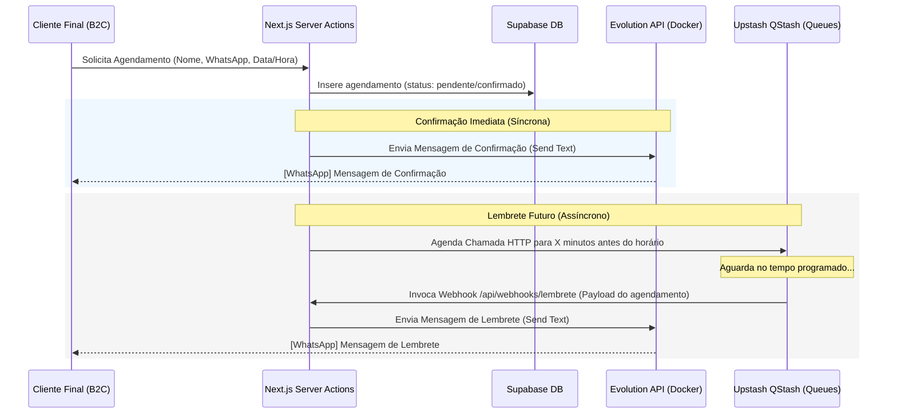

# 06 - Mensageria e Integração WhatsApp (Evolution API + QStash)

Este documento define os padrões, fluxos e payloads da arquitetura de mensageria via WhatsApp e agendamentos de lembretes em background do **VamoAgendar**.

---

## 🔄 Fluxo de Mensagens e Ciclo de Vida

O VamoAgendar possui um fluxo de mensagens simples e direto, focado exclusivamente em **notificar** e **lembrar** o cliente final.



---

## 🗄️ Modelagem de Dados: Tabela `whatsapp_configs`

Cada organização/tenant possui sua própria conexão de WhatsApp. As configurações de conexão e os textos das mensagens são armazenados na tabela `whatsapp_configs`.

### Estrutura do Schema

```sql
CREATE TABLE whatsapp_configs (
    id uuid DEFAULT gen_random_uuid() PRIMARY KEY,
    tenant_id text NOT NULL UNIQUE,
    instance_name text NOT NULL UNIQUE,
    instance_token text, -- O apikey de autenticação retornado pela Evolution API para esta instância
    status text NOT NULL DEFAULT 'desconectado' CHECK (status IN ('desconectado', 'aguardando_qrcode', 'conectado')),
    mensagem_confirmacao text NOT NULL DEFAULT 'Olá {{cliente}}, seu agendamento em {{empresa}} para {{data_hora}} está confirmado!',
    mensagem_lembrete text NOT NULL DEFAULT 'Olá {{cliente}}, passando para lembrar do seu agendamento em {{empresa}} no dia {{data}} às {{hora}}.',
    tempo_lembrete_minutos integer NOT NULL DEFAULT 120, -- Padrão de 2 horas antes
    created_at timestamp with time zone DEFAULT timezone('utc'::text, now()) NOT NULL,
    updated_at timestamp with time zone DEFAULT timezone('utc'::text, now()) NOT NULL
);

-- Ativação do RLS
ALTER TABLE whatsapp_configs ENABLE ROW LEVEL SECURITY;

-- Políticas de RLS (B2B - Apenas donos do Tenant)
CREATE POLICY "Permitir SELECT para membros da org autenticados" 
ON whatsapp_configs FOR SELECT TO authenticated
USING (tenant_id = (SELECT auth.jwt() ->> 'org_id'));

CREATE POLICY "Permitir INSERT para membros da org autenticados" 
ON whatsapp_configs FOR INSERT TO authenticated
WITH CHECK (tenant_id = (SELECT auth.jwt() ->> 'org_id'));

CREATE POLICY "Permitir UPDATE para membros da org autenticados" 
ON whatsapp_configs FOR UPDATE TO authenticated
USING (tenant_id = (SELECT auth.jwt() ->> 'org_id'))
WITH CHECK (tenant_id = (SELECT auth.jwt() ->> 'org_id'));

COMMENT ON TABLE whatsapp_configs IS 'Armazena as configurações de integração e instâncias do WhatsApp da Evolution API para cada tenant.';
```

---

## 🔗 Integração com a Evolution API (v2)

A comunicação com a Evolution API é protegida pela chave de API global (para gerenciamento de instâncias) e pela chave de API específica da instância (para envio de mensagens).

### 1. Criar Instância (`POST`)
Ao clicar em "Conectar WhatsApp" no painel, o Next.js cria a instância no gateway.
* **Endpoint:** `POST {EVOLUTION_API_URL}/instance/create`
* **Header:** `apikey: {EVOLUTION_GLOBAL_API_KEY}`
* **Payload:**
  ```json
  {
    "instanceName": "instancia_org_xxxxxx",
    "qrcode": true,
    "integration": "WHATSAPP-BAILEYS"
  }
  ```
* **Campos Relevantes da Resposta (HTTP 201):**
  * `instance.instanceName`: Nome da instância criada.
  * `hash.apikey`: O token da instância gerado pela Evolution API. **Salvamos este valor no campo `instance_token` no banco.**

### 2. Conectar (Obter QR Code em base64)
Para mostrar o QR Code na tela de conexão para o profissional escanear.
* **Endpoint:** `GET {EVOLUTION_API_URL}/instance/connect/{instanceName}`
* **Header:** `apikey: {EVOLUTION_GLOBAL_API_KEY}`
* **Resposta (HTTP 200):** Retorna o QR Code codificado em base64 (string que começa com `data:image/png;base64,...`) e o código de texto puro para pareamento.

### 3. Enviar Mensagem de Texto (`POST`)
Para enviar notificações e lembretes aos clientes.
* **Endpoint:** `POST {EVOLUTION_API_URL}/message/sendText/{instanceName}`
* **Header:** `apikey: {INSTANCE_TOKEN}` (O token específico da instância recuperado da tabela `whatsapp_configs`)
* **Payload:**
  ```json
  {
    "number": "5511999999999",
    "text": "Texto final com as variáveis substituídas..."
  }
  ```

---

## 📝 Substituição de Variáveis via Código

Antes de realizar a requisição de disparo para a Evolution API, a Server Action ou o Webhook de lembrete deve processar e substituir as variáveis do template do banco usando os dados do cliente e da empresa.

### Regra de Substituição (Next.js Helper)

Criaremos uma função utilitária para substituir as chaves dinâmicas:

```typescript
interface SubstituicaoParams {
    template: string
    clienteNome: string
    empresaNome: string
    dataHoraStr: string // Ex: "05/07/2026 às 14:00"
}

export function processarMensagemTemplate({
    template,
    clienteNome,
    empresaNome,
    dataHoraStr
}: SubstituicaoParams): string {
    // Quebra a data e hora para templates de lembrete se necessário
    const [dataPart, horaPart] = dataHoraStr.split(" às ");

    return template
        .replace(/{{cliente}}/g, clienteNome)
        .replace(/{{empresa}}/g, empresaNome)
        .replace(/{{data_hora}}/g, dataHoraStr)
        .replace(/{{data}}/g, dataPart || '')
        .replace(/{{hora}}/g, horaPart || '');
}
```

> [!TIP]
> O número do telefone do destinatário na Evolution API deve conter sempre o código do país (`55` para Brasil), o DDD (2 dígitos) e o número do celular. Remova formatações (parênteses, traços, espaços) via Regex no backend antes do envio: `telefone.replace(/\D/g, '')`.
