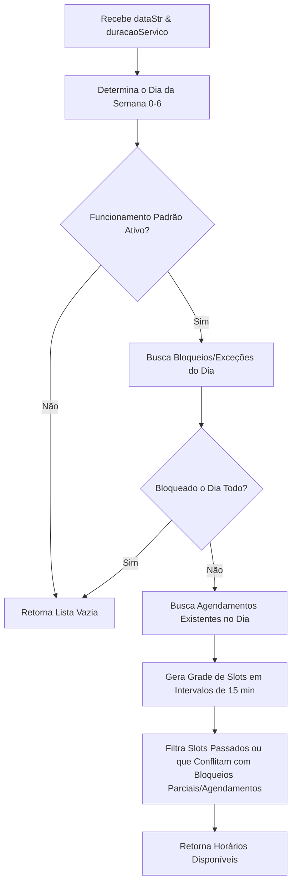

# Etapa 2 - Engine de Disponibilidade (Availability Engine)

Este documento descreve as regras lógicas e a implementação da engine responsável por calcular, em tempo real, quais horários estão livres para agendamento.

---

## 🌎 O Desafio do Fuso Horário

Como a aplicação roda em ambiente serverless (cujo fuso do servidor costuma ser UTC), e atende o mercado brasileiro (onde o fuso padrão é o de Brasília - UTC-3), todas as operações de data e hora no banco são normalizadas em UTC, mas interpretadas e filtradas com base no fuso `America/Sao_Paulo`.

Sem esse alinhamento, limites de datas (como "meia-noite") causariam vazamento de horários do dia anterior ou seguinte.

---

## ⚙️ Funcionamento do Algoritmo (`lib/booking-engine.ts`)

A função `obterSlotsDisponiveis` recebe as entradas `tenantId`, `dateStr` (formato `YYYY-MM-DD`), `duracaoServicoMinutos` e a instância ativa do cliente Supabase. Ela executa o seguinte fluxo:

### Detalhamento dos Passos

1.  **Limites do Dia em UTC**:
    As buscas no banco de dados usam timestamps que delimitam o dia de Brasília convertidos para UTC:
    *   Início: `${dateStr}T00:00:00-03:00`
    *   Fim: `${dateStr}T23:59:59-03:00`

2.  **Verificação de Funcionamento Padrão**:
    Consulta a tabela `horarios_funcionamento` para o dia da semana correspondente à data informada. Se o estabelecimento estiver marcado como fechado para aquele dia da semana, o cálculo encerra imediatamente retornando `[]`.

3.  **Filtragem de Bloqueios**:
    Busca na tabela `excecoes_agenda` se há algum bloqueio cadastrado para a data específica. Se houver um bloqueio marcado como "dia inteiro", a engine encerra retornando `[]`. Se for parcial (ex: das 14:00 às 16:00), essa janela horária é salva na memória para posterior filtragem dos slots gerados.

4.  **Recuperação de Ocupação Atual**:
    Busca todos os agendamentos confirmados ou pendentes ativos na data solicitada, juntando a duração de cada serviço relacionado (`duracao_minutos`). Cada agendamento ativo cria uma "janela de ocupação" que se estende do horário de início até o fim calculado (`início + duracao_minutos`).

5.  **Geração e Refinamento de Slots**:
    *   A partir do horário de abertura padrão do dia (ex: 08:00) até o de fechamento (ex: 18:00), a engine gera slots em intervalos fixos de 15 minutos.
    *   Para cada slot gerado, valida se cabe o serviço selecionado dentro do horário de fechamento e se a janela ocupada por ele (`hora_slot + duracaoServicoMinutos`) não invade nenhuma das seguintes áreas:
        *   **Passado**: Se a data do agendamento for hoje, impede a exibição de horários que já passaram em relação à hora atual de Brasília.
        *   **Exceções Parciais**: Não pode sobrepor janelas de bloqueio manual.
        *   **Conflito de Agendamento**: Não pode sobrepor nenhuma das janelas ocupadas recuperadas no passo 4.

6.  **Saída**:
    Retorna uma lista de objetos contendo a hora formatada (`HH:MM`) e o timestamp ISO correspondente em UTC (ex: `2026-07-03T11:00:00.000Z`), pronto para ser inserido na tabela de agendamentos.
