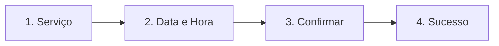

# Etapa 4 - Fluxo de Agendamento Público (B2C Booking Flow)

Este documento registra a arquitetura técnica e de experiência do usuário (UX) do fluxo de reservas pública do **VamoAgendar**, estruturado para maximizar conversões e eliminar o atrito do cliente final.

---

## ⚡ Filosofia de Fricção Zero

Diferente de sistemas concorrentes que forçam o cliente a fazer cadastro, verificar o e-mail via código OTP ou baixar um aplicativo para reservar um horário, o **VamoAgendar** elimina barreiras:
*   **Sem Autenticação**: O fluxo é 100% público e ocorre na rota `/book/[slug]`.
*   **Identificação Simples**: O cliente informa apenas Nome e Telefone/WhatsApp (para onde os alertas automáticos serão enviados).
*   **Passos Consolidados**: Em vez de múltiplas páginas físicas e reloads, o fluxo roda sob um componente interativo centralizado (`BookingWizard.tsx`) com transições reativas.

---

## 🧭 O Fluxo do Wizard Interativo (`BookingWizard.tsx`)

O assistente de agendamento conduz o cliente através de quatro fases lineares:

### 1. Seleção de Serviço
*   Exibe a lista de todos os serviços do estabelecimento que estão marcados como `ativo = true`.
*   Apresenta com destaque o nome, a descrição detalhada, a duração em minutos e o valor formatado em Real brasileiro (R$).

### 2. Escolha de Data e Hora
*   **Seletor de Datas Horizontal**: Um carrossel de 14 dias gerado a partir de hoje no fuso local. Mostra o dia do mês e a abreviação do dia da semana (ex: "SEG", "TER").
*   **Grid de Slots**: Ao selecionar uma data, o assistente faz uma chamada assíncrona para a Server Action `obterSlotsPublicos`. A engine calcula em tempo real os horários disponíveis. Os horários livres aparecem formatados em um grid de botões simples (`09:00`, `09:15`, etc.). Caso não haja slots disponíveis, um aviso amigável instrui o usuário a tentar outra data.

### 3. Dados de Contato
*   O formulário solicita:
    *   **Nome Completo** (Obrigatório).
    *   **WhatsApp** (Opcional, mas obrigatório se o e-mail não for informado).
    *   **E-mail** (Opcional).
*   Validação no lado do cliente bloqueia o envio caso o número telefônico não contenha o formato correto (DDD + 9 ou 8 dígitos).

### 4. Sucesso (Tíquete de Confirmação)
*   Após a gravação bem-sucedida, exibe uma tela que emula um "tíquete" impresso contendo:
    *   Símbolo visual de confirmação na cor verde (`emerald`).
    *   Nome do estabelecimento.
    *   Serviço reservado.
    *   Data e hora formatada por extenso no fuso brasileiro (ex: "Sexta-feira, 03 de Julho de 2026 às 15:30").

---

## 🔒 Mecanismos de Integridade e Prevenção de Abuso

Como o endpoint é de livre acesso público (`anon`), aplicamos verificações rigorosas no backend para garantir a integridade dos dados:

1.  **Validação de Slot de Último Segundo**:
    Antes de inserir o registro na tabela de agendamentos, a Server Action `criarAgendamentoPublico` executa a engine de disponibilidade novamente. Se outro cliente reservar o mesmo horário na fração de segundos anterior, a ação rejeita o agendamento atual com um erro claro, prevenindo a sobreposição de horários (*double-booking*).
2.  **Sanitização de Número de Telefone**:
    Remove todos os caracteres não numéricos antes de salvar no banco e valida o tamanho final (10 ou 11 dígitos), evitando inputs inválidos de texto.
3.  **Duplicidade de Clientes**:
    Se o cliente já tiver agendado anteriormente com o mesmo número de WhatsApp para aquele tenant, a action o identifica e reaproveita o ID existente, mantendo o histórico unificado e evitando a poluição da tabela `clientes`.
