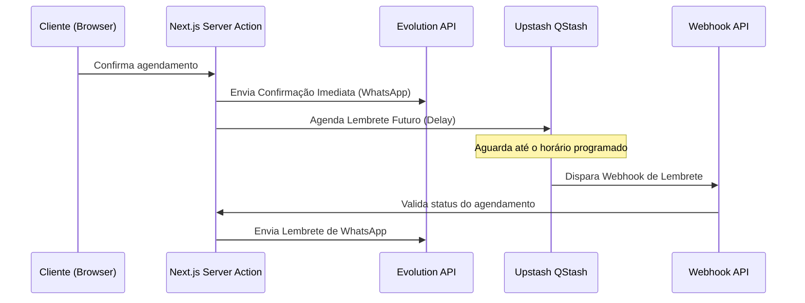

# Etapa 5 - Mensageria, WhatsApp e Agendador de Lembretes (QStash)

Este documento descreve a infraestrutura de mensageria assíncrona do **VamoAgendar**, integrando a **Evolution API** e o **Upstash QStash** para disparar confirmações e lembretes automáticos.

---

## 🏗️ Arquitetura do Sistema de Mensagens

O ecossistema é composto por três blocos:

1.  **Gateway de WhatsApp (Evolution API)**:
    Instância self-hosted responsável pelo canal de envio das mensagens de texto. Cada tenant logado possui sua própria instância dedicada no gateway (criada via `/instance/create`), que gera o QR Code exibido no painel de configurações.
2.  **Agendador de Tarefas (Upstash QStash)**:
    Serviço serverless que recebe requisições de agendamento HTTP e as retém em uma fila durável até o momento exato de disparar a chamada de volta para nossa API.
3.  **Webhook de Processamento (`/api/webhooks/lembrete`)**:
    Rota de API interna do Next.js que recebe o gatilho do QStash no momento correto, aplica regras de negócio finais e efetua o disparo.

---

## ⚙️ Fluxo Operacional de Disparos

### 1. Confirmação Imediata (No Agendamento)
No instante em que o agendamento é gravado no banco de dados através da Server Action pública:
1.  Busca as configurações do WhatsApp do tenant (`whatsapp_configs`). Se estiver desconectado, o fluxo encerra sem erro para o cliente (Frictionless).
2.  Gera o texto de confirmação substituindo as tags no template:
    *   `{{cliente}}` &rarr; Nome do cliente.
    *   `{{empresa}}` &rarr; Nome fantasia do estabelecimento.
    *   `{{data_hora}}` &rarr; Data e hora local formatada (ex: `03/07/2026 às 15:30`).
3.  Efetua uma chamada HTTP `POST` para a rota `/message/sendText/{instanceName}` da Evolution API passando o token da instância ativa.

### 2. Agendamento do Lembrete
Logo após o envio da confirmação imediata:
1.  Calcula o momento do lembrete: `data_hora_agendamento - tempo_lembrete_minutos` (ex: 2 horas antes do horário marcado).
2.  Verifica se esse horário calculado está no futuro. Se estiver, faz um request `POST` para o Upstash QStash:
    *   **Destino**: `{APP_URL}/api/webhooks/lembrete?secret={CHAVE_SECRETA}`
    *   **Header `Upstash-Not-Before`**: Timestamp Unix em segundos em que a mensagem deve ser processada pelo QStash.
    *   **Payload**: `{ agendamentoId, tenantId }`

### 3. Execução do Webhook de Lembrete
Quando o QStash atinge o tempo configurado no cabeçalho, ele faz uma chamada HTTP para a rota de API correspondente no Next.js:
1.  **Segurança**: O webhook valida o parâmetro `secret` da URL contra o `QSTASH_CURRENT_SIGNING_KEY` local. Requisições sem chave ou com chave incorreta são rejeitadas com status `401 Unauthorized`.
2.  **Verificação de Cancelamento**: Consulta o agendamento atualizado no Supabase. Se o cliente tiver cancelado o agendamento antes do horário do lembrete, a execução é abortada retornando sucesso (`200 OK`) sem enviar a mensagem.
3.  **Disparo do Lembrete**: Caso o agendamento permaneça ativo, renderiza o template de lembrete com as informações corretas e chama a Evolution API para entregar a mensagem ao destinatário.

---

## ✍️ Substituição Inteligente de Variáveis

Criamos um utilitário robusto em `src/lib/whatsapp-helper.ts` que permite a criação de templates flexíveis pelo profissional. O helper substitui:
*   `{{cliente}}`: Nome completo ou de preferência informado no agendamento.
*   `{{empresa}}`: Nome fantasia do estabelecimento profissional.
*   `{{data_hora}}`: Data e horário combinados (ex: `05/07/2026 às 14:00`).
*   `{{data}}`: Apenas a data do agendamento (ex: `05/07/2026`).
*   `{{hora}}`: Apenas o horário do agendamento (ex: `14:00`).
